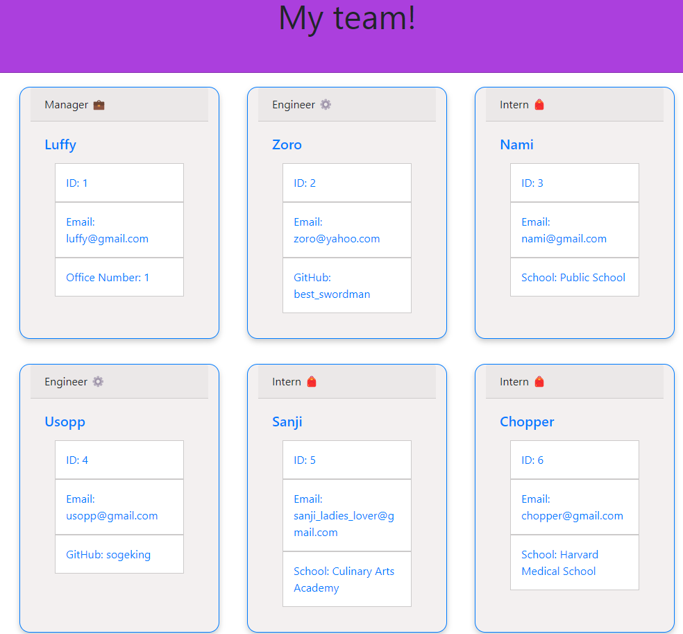

# Team profile Gen
## 
Node.js command-line app that takes information about employees on a Software Engineering Team and generates an HTML webpage that displays the information about each person.

# Table of Contents
- [Go to installation section](#-installation)
- [Go to usage guide section](#-usage-guide)
- [Go to contribution guidelines section](#-contribution-guidelines)
- [Go to test instructions section](#-test-instructions)
- [Go to questions section](#-questions)

# Concepts applied
- [x] Node JS 🖥️

- [x] Terminal Commands 🤔

- [x] File creation and file management 🔒

- [x] Javascript 🖥️

# Installation
Run the Index.js on your terminal or on IDE that supports Node.JS

# Usage Guide
He can use it if he wants a way to visualize his/her team

# Contribution Guidelines
David Torres

# Test Instructions
There are some test about each class in the __test__ folder

# License
MIT

# Questions
- Here's my GitHub Profile in case you want to reach out!: https://github.com/davidtc8
- Here's my email in case you want to write me: davidtorres@gmail.com

# Image

